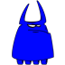
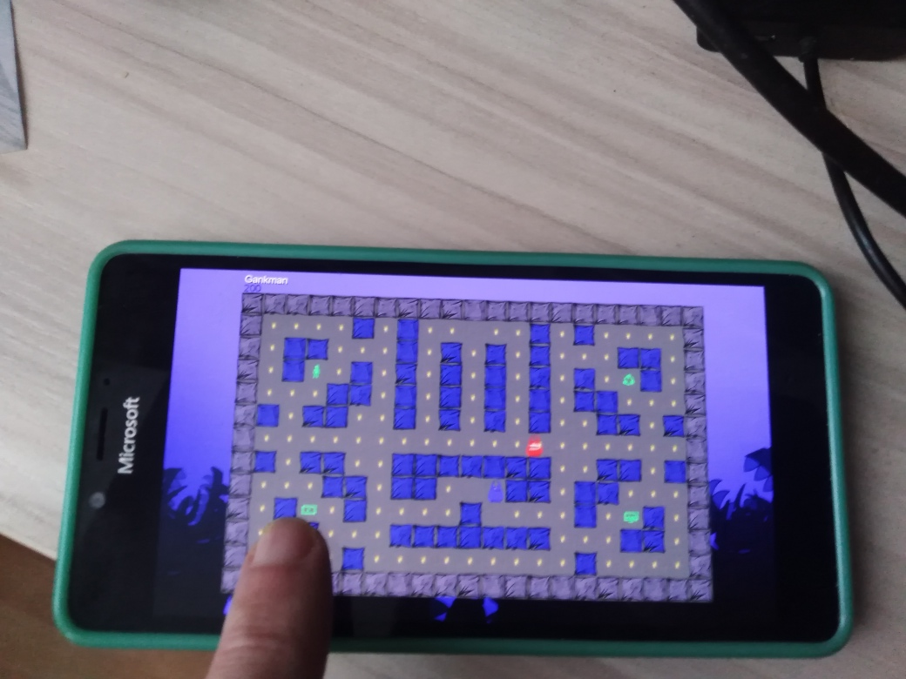
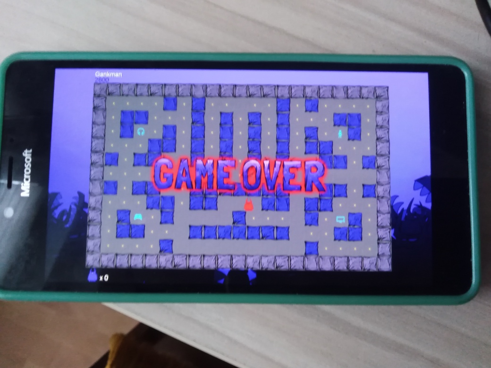

# ChompGame v1.0.0.0

A sample game written with MonoGame that targets UWP (xbox, windows 10/11 desktop, and windows 10 mobile) :)  

## Screenshots

## My 2 cents
- I started to adapt the src code for W10M (min Win10Mobile os build > 10240; 10240 -- touchpanel may not work!).

## Status
PoC / Early bird (still exploring Content compilation process... fonts generation, texturec, etc.)))

## Experimental part
Xbox Live code is included, however the title id and other config is not. 
The Xbox Live config for this project is no longer running, but you can at least see how the code works.

## Requirements

* MonoGame v3.7 (or higher)
* [Visual Studio 2017](https://visualstudio.microsoft.com/) (or higher)

## Credits/Special Thanks

* [Joey Buczek](https://github.com/joeybuczek) - Art
* [David Wallimann](https://www.davidwallimann.com/) - Music & Sound
* [Brian Peek](https://github.com/BrianPeek/) - ChompGame's (uwp edition) creator/developer

## . 
As is. No support.RnD only

## .
[m][e] 2024
